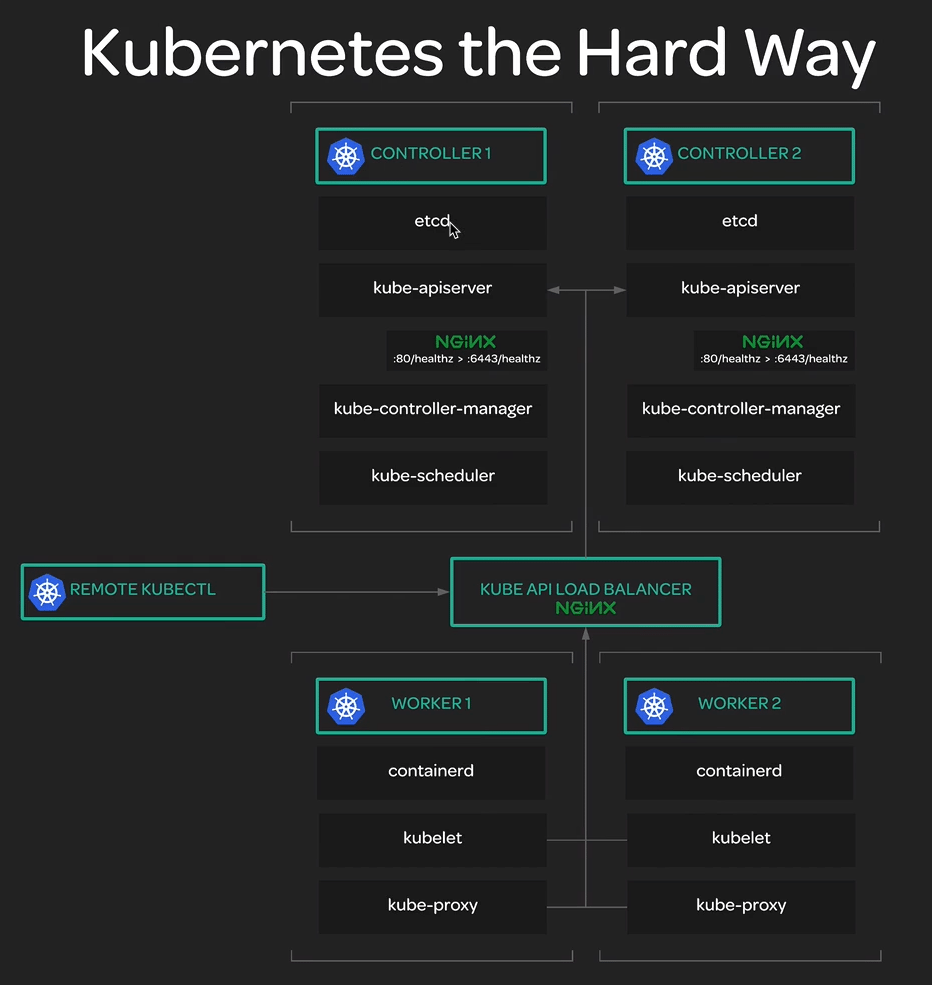

# Kubernetes the Hard Way

*A simple & real quick deployment of Kubernetes HA Cluster based on "Kubernetes the Hard Way"*

## Architecture

1. No. of Kubernetes Control (Masters) Plane : 2
2. No. of Kubernetes Worker (Minions) Nodes : 3
3. Kubernetes API LoadBalancer : 1
4. Kuberetes Provisioner (Localhost which you would use for cluster deployment!) : 1



## Prerequisites

1. User needs to be root among all these nodes : `(Kubernetes Masters, Workers, API LB Server and Provisioner Host)` in order to deploy the script.
2. Password less authentication must be set among all these nodes : `Provisioner, Kubernetes Masters, Workers, and API LoadBalancer.`
3. All the required variables must be updated in `clusterConfigs.txt` file prior to start the deployment.
4. Kubernetes API LoadBalancer details must be updated in `clusterConfigs.txt`.
5. Kubernetes Workers details must be updated in `clusterConfigs.txt`.
6. Kubernetes Certificates details must be updated in `clusterConfigs.txt`.

## Inputs

This is the main configuration file to deploy the whole cluster. It contains Kubernetes Nodes de, Kubernetes Certificates Details, Kubernetes Controller Public IP, Local Host (Workstation) Details, Kubernetes ETCD Cluster Configurations and so forth.

| Name | Description | Type | Default | Required |
|------|-------------|:----:|:-----:|:-----:|
| CONTROL_PLANES | An array of Kubernetes Masters' FQDN. | array | (kube-master01.gsslab.pnq2.redhat.com kube-master02.gsslab.pnq2.redhat.com) | yes |
| CONTROL_PLANES_IPS | An array of Kubernetes Master's IP Address. | array | (10.74.250.10 10.74.254.170) | yes |
| ETCD_CLUSTER_CONFIGS | Endpoints of ETCD Cluster. | string | "https://10.74.250.10:2379,https://10.74.254.170:2379" | yes |
| CLUSTER_CIDR | CIDR range for allocating IP addresses within Kubernetes Cluster | string | "10.200.0.0/16" | yes |
| SERVICE_CLUSTER_CIDR | CIDR range for allocating IP addresses for Kubernetes Services | string | "10.32.0.0/24" | yes |
| POD_CIDR | CIDR range for allocating IP addresses within Pods | string | "10.200.0.0/16" | yes |
| KUBE_API_LB | Kubernetes API LoadBalancer FQDN | string | "kube-api-lb.gsslab.pnq2.redhat.com" | yes |
| API_LB_IP | Kubernetes API LoadBalancer IP | string | "10.200.0.0/16" | yes |
| API_CERT_HOSTNAMES | List of allowed hosts and ips of Kubernetes nodes to access API server. | string | "10.32.0.1,10.74.250.10,kube-master01.gsslab.pnq2.redhat.com,10.74.254.170,kube-master02.gsslab.pnq2.redhat.com,10.74.225.110,kube-api-lb.gsslab.pnq2.redhat.com,127.0.0.1,kubernetes.default" | yes |
| KUBE_WORKERS | An array of Kubernetes Workers' FQDN. | array | (kube-worker01.gsslab.pnq2.redhat.com kube-worker02.gsslab.pnq2.redhat.com kube-worker03.gsslab.pnq2.redhat.com) | yes |
| KUBE_WORKERS_IPS | An array of Kubernetes Workers' IP. | array | (10.74.253.199 10.74.250.141 10.74.249.90) | yes |
| LOCAL_HOST | Provisioner (localhost) from which the deployment script will be run. | string | "desktop.vgosai.redhat.com.users.ipa.redhat.com" | yes |
| LOCAL_HOST_IP | IP Address of the Provisioner. | string | "10.65.144.128" | yes |
| LOCAL_KUBE_CONFIG_PATH | Temporarily directory on Provisioner machine to keep Kubernetes Certs, Configs, Keys and so forth. | string | "/tmp/kubernetes" | yes |
| C | Certificate Object: Country, default INDIA | string | "IN" | yes |
| L | Certificate Object: Locality, default DELHI | string | "DELHI" | yes |
| O | Certificate Object: Orgnization, default DEVOPS | string | "DevOps" | yes |
| OU | Certificate Object: Orgnization Unit, default ENGINEERING | string | "ENG" | yes |
| ST | Certificate Object: State, default NEW DELHI | string | "NEWDELHI" | yes |

* Sample Configuration which I used for deploying cluster.

```bash
# ------------------------------------------------------------------------------------------------------------------------------------------------- #
# --------------------------------------------------------- Kubernetes Master Nodes Configs ------------------------------------------------------- #
# ------------------------------------------------------------------------------------------------------------------------------------------------- #
CONTROL_PLANES=(kube-master01.gsslab.pnq2.redhat.com kube-master02.gsslab.pnq2.redhat.com)
CONTROL_PLANES_IPS=(10.74.250.10 10.74.254.170)
ETCD_CLUSTER_ENDPOINTS="https://10.74.250.10:2379,https://10.74.254.170:2379"
ETCD_CLUSTER_CONFIGS="kube-master01.gsslab.pnq2.redhat.com=https://10.74.250.10:2380,kube-master02.gsslab.pnq2.redhat.com=https://10.74.254.170:2380"
CLUSTER_CIDR="10.200.0.0/16"
SERVICE_CLUSTER_CIDR="10.32.0.0/24"
POD_CIDR="10.200.0.0/16"
# ------------------------------------------------------------------------------------------------------------------------------------------------- #
# ---------------------------------------------------- Kubernetes API Load Balancer Configs ------------------------------------------------------- #
# ------------------------------------------------------------------------------------------------------------------------------------------------- #
KUBE_API_LB="kube-api-lb.gsslab.pnq2.redhat.com"
API_LB_IP="10.74.255.110"
API_CERT_HOSTNAMES="10.32.0.1,10.74.250.10,kube-master01.gsslab.pnq2.redhat.com,10.74.254.170,kube-master02.gsslab.pnq2.redhat.com,10.74.225.110,kube-api-lb.gsslab.pnq2.redhat.com,127.0.0.1,kubernetes.default"
# ------------------------------------------------------------------------------------------------------------------------------------------------- #
# --------------------------------------------------------- Kubernetes Worker Nodes Configs ------------------------------------------------------- #
# ------------------------------------------------------------------------------------------------------------------------------------------------- #
KUBE_WORKERS=(kube-worker01.gsslab.pnq2.redhat.com kube-worker02.gsslab.pnq2.redhat.com kube-worker03.gsslab.pnq2.redhat.com)
KUBE_WORKERS_IPS=(10.74.253.199 10.74.250.141 10.74.249.90)
# ------------------------------------------------------------------------------------------------------------------------------------------------- #
# --------------------------------------------------------- Provisoner Host Configs --------------------------------------------------------------- #
# ------------------------------------------------------------------------------------------------------------------------------------------------- #
LOCAL_HOST="desktop.vgosai.redhat.com.users.ipa.redhat.com"
LOCAL_HOST_IP="10.65.144.128"
LOCAL_KUBE_CONFIG_PATH=/tmp/kubernetes
# ------------------------------------------------------------------------------------------------------------------------------------------------- #
# --------------------------------------------------------- Kubernetes Certificates Details ------------------------------------------------------- #
# ------------------------------------------------------------------------------------------------------------------------------------------------- #
C=IN
L=DELHI
O=DevOps
OU=ENG
ST=NEWDELHI
```

## Usage

1. `deployKubernetesTheHardway.sh`: *Main script which provisions the entire Kubernetes Cluster*
2. `clusterConfigs.txt`: *Stores all the required variable to bootstrap Kubernetes HA Cluster*
3. `checkPrerequisites.sh`:  *Performs edge case checks prior to deploy the Kubernetes cluster*
4. `installBinaries.sh`: *Installs all the required binaries on Provisoner*
5. `provisionKubeCerts.sh` : *Provisions all the required certificates for Kubernetes Cluster.*
6. `provisionKubeConfigs.sh`: *Provisions all the required configuration files for Kubernetes cluster*
7. `provisionKubernetesCluster.sh`: *Bootstraps Kubernetes Masters, Workers, API LoadBalancer and ETCD nodes.*
8. `provisionClusterNetworking.sh`: *Provisions Kubernetes Cluster CNI Networking.*
9. `provisionKubeDNS.sh`: *Provisions Kubernetes DNS service*


## Installation

To deploy the fully function Kubernetes High Availability Cluster, you just have to clone the repository, make the necessary changes in clusterConfig.txt file and then run
deployKubernetesTheHardway.sh script. It will automatically provision the whole cluster for you and finally perform some smoke tests to validate the deployment.

```bash
git clone https://github.com/vijayg92/kubernetes-the-hard-way.git
cd kubernetes-the-hard-way
## Make sure to update all the required variables here.
vim clusterConfig.txt
## Finally run the deployment script.
./deployKubernetesTheHardway.sh
```

## Testing
Coming Soon

## Contributing
Pull requests are welcome. For major changes, please open an issue first to discuss what you would like to change.

## License
[GPLv3](https://www.gnu.org/licenses/)
